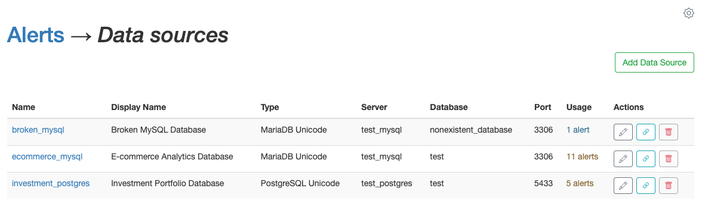
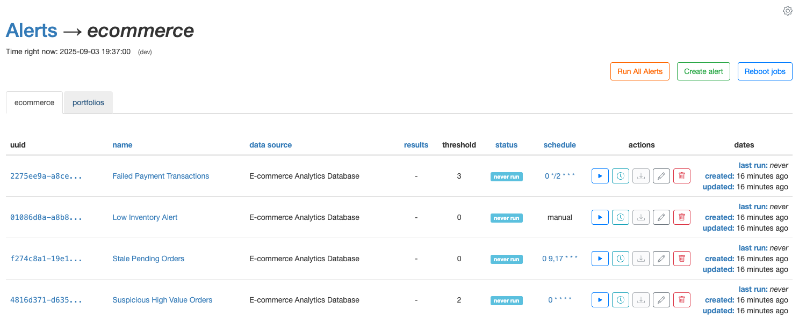
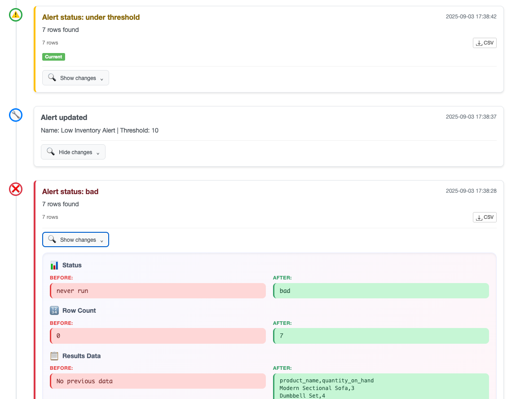
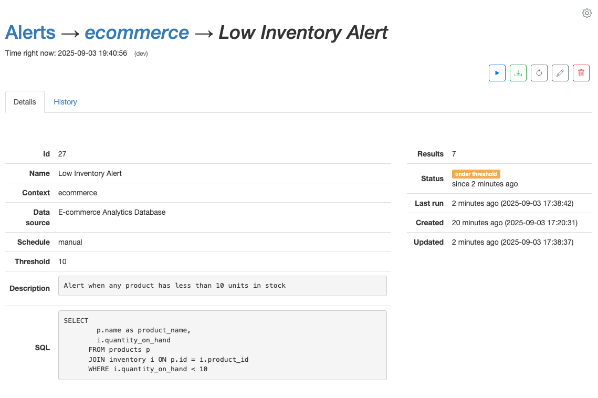

# Elixir Alerts

A Phoenix application for monitoring database data and generating alerts with encrypted data source credentials. Connect to multiple databases (MySQL, PostgreSQL), create alerts with custom SQL queries, and get notified when thresholds are exceeded. Features encrypted credential storage, master password protection, and full SSL/HTTPS support.

## Screenshots

### Data Source Management
Securely manage multiple database connections with encrypted credentials:



### Alert Dashboard
Monitor all your alerts with real-time status updates and context filtering:



### Alert Timeline & History
Track alert changes and results over time with detailed diff visualization:



### Alert Details & Monitoring
View individual alert status, execution results, and downloadable CSV data:



## Development Environment

Local development with hot reload and debugging capabilities.

### Setup & Run
```bash
# Initialize environment (creates/drops database)
./bin/helpers/init_environment.sh dev

# Start development server
./bin/dev/startup.sh
```
**→ Access at http://localhost:4000**

### With SSL (Optional)
```bash
# Generate self-signed certificate (stored in container)
./bin/helpers/crypto/generate_self_signed_cert.sh dev

# Restart to enable SSL (startup script auto-detects certificates)
./bin/dev/startup.sh
```
**→ Access at https://localhost:4001 (HTTPS) or http://localhost:4000 (HTTP) - both work independently**

*Note: Self-signed certificates will show browser security warnings - click through to proceed.*

---

## Test Environment

Automated testing with clean database state and E2E browser tests.

### Setup & Run
```bash
# Initialize test environment
./bin/helpers/init_environment.sh test

# Start test server
./bin/test/startup.sh
```
**→ Access at http://localhost:4002**

### Run Tests
```bash
# Backend tests (Elixir/Phoenix)
./bin/test/run_backend_tests.sh

# E2E tests (Playwright)
./bin/test/run_e2e_tests.sh

# E2E with specific pattern and workers
./bin/test/run_e2e_tests.sh -w 3 "T4"
```

---

## Production Environment

Production-ready deployment with security hardening and SSL/HTTPS.

### Setup & Run
```bash
# Initialize production environment
./bin/helpers/init_environment.sh prod

# Start production server
./bin/prod/startup.sh
```
**→ Access at http://localhost:4004**

### SSL Configuration (Required)

**Option 1: Self-signed certificate (testing)**
```bash
# Generate certificate (stored in container)
./bin/helpers/crypto/generate_self_signed_cert.sh prod

# Optional: Generate with custom domain
SSL_DOMAIN="yourdomain.com" ./bin/helpers/crypto/generate_self_signed_cert.sh prod
```

**Option 2: CA-signed certificate (production)**
```bash
# Get Let's Encrypt certificate (on host)
sudo certbot certonly --standalone -d yourdomain.com

# Copy certificates to running container
docker cp /etc/letsencrypt/live/yourdomain.com/fullchain.pem alerts_phoenix_prod:/app/priv/ssl/prod/cert.pem
docker cp /etc/letsencrypt/live/yourdomain.com/privkey.pem alerts_phoenix_prod:/app/priv/ssl/prod/key.pem
```

**Enable SSL and restart:**
```bash
# Start production server (auto-detects SSL certificates)
./bin/prod/startup.sh
```
**→ Access at https://localhost:4005 (HTTPS) or http://localhost:4004 (HTTP redirects to HTTPS)**

### Security Management
```bash
# Rotate encryption keys (re-encrypts all data source passwords)
./bin/helpers/crypto/rotate_encryption_key.sh prod

# Initialize encryption key
./bin/helpers/crypto/init_encryption_key.sh prod
```

### Master Password Protection (Optional)

Add application-level password protection requiring login to access the web interface.

```bash
# Set up master password for any environment
./bin/helpers/crypto/setup_master_password.sh dev
./bin/helpers/crypto/setup_master_password.sh prod

# Or provide password directly (non-interactive)
./bin/helpers/crypto/setup_master_password.sh dev "your_secure_password"
```

**Configuration:**
```bash
# Set session timeout (default: 10 minutes)
SESSION_TIMEOUT_MINUTES=30 ./bin/dev/startup.sh
```

**Security Features:**
- SHA-256 hashed passwords encrypted with AES-256-GCM
- Session-based authentication with configurable timeout
- Login screen protection for all routes
- No environment variable bypasses

